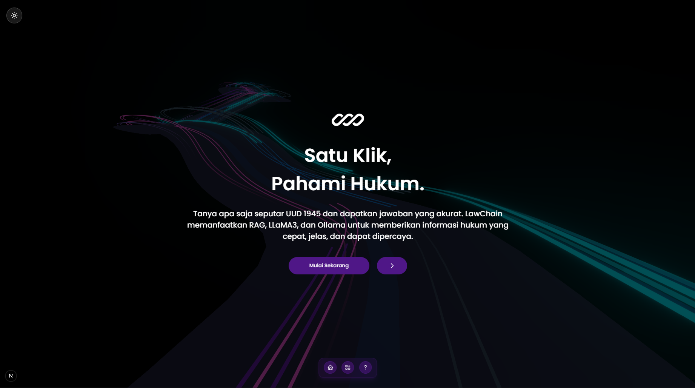
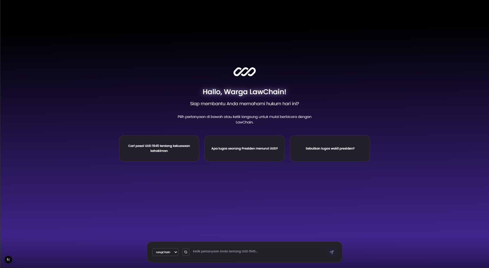
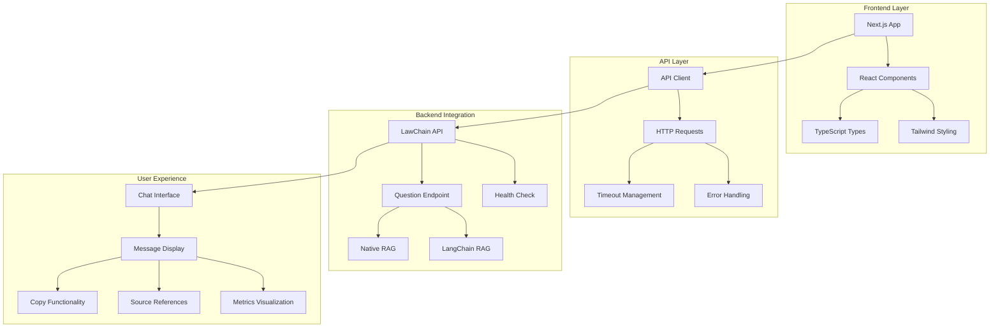

# 🏛️ LawChain Frontend - Chatbot Hukum UUD 1945

**Interface Modern untuk Chatbot Hukum UUD 1945 Berbasis AI**

[](https://nextjs.org/)
[](https://www.typescriptlang.org/)
[](https://tailwindcss.com/)
[](https://reactjs.org/)

## 📋 Deskripsi Proyek

LawChain Frontend adalah antarmuka pengguna modern yang dirancang khusus untuk berinteraksi dengan sistem chatbot hukum UUD 1945. Aplikasi ini dibangun menggunakan **Next.js 15**, **TypeScript**, dan **Tailwind CSS** untuk memberikan pengalaman pengguna yang optimal dalam mengakses informasi hukum konstitusi Indonesia.

### 🎯 Fitur Utama

- **🤖 Chatbot Interaktif**: Interface chat real-time dengan AI untuk pertanyaan hukum UUD 1945
- **🔄 Dual RAG Methods**: Pilihan antara metode LangChain dan Native RAG
- **📊 Metrics Display**: Tampilan akurasi, relevansi, dan kelengkapan jawaban
- **📚 Source References**: Referensi dokumen resmi dengan link ke sumber asli
- **📋 Copy Functionality**: Fitur copy jawaban untuk kemudahan penggunaan
- **🎨 Modern UI/UX**: Desain responsif dengan animasi dan transisi halus
- **⚡ Real-time Status**: Monitoring status koneksi API secara real-time
- **📱 Responsive Design**: Kompatibel dengan desktop, tablet, dan mobile

## �️ Screenshots

### Halaman Utama


_Interface utama dengan pertanyaan rekomendasi dan desain yang elegan_

### Interface Chatbot


_Tampilan chatbot dengan metrics, referensi dokumen, dan fitur copy_

## 🏗️ Arsitektur Sistem



## 📁 Struktur Proyek

```
fe-lawchain/
├── 📁 public/                     # Assets statis
│   ├── 📁 logo/                   # Logo dan branding
│   │   ├── logo.svg
│   │   ├── logo-1.svg
│   │   └── logo-2.svg
│   ├── 📁 readme/                 # Screenshots untuk dokumentasi
│   │   ├── home.png
│   │   └── chatbot.png
│   └── 📁 mengapa-kami/           # Assets untuk landing page
├── 📁 src/                        # Source code utama
│   ├── 📁 app/                    # App Router (Next.js 13+)
│   │   ├── 📄 layout.tsx          # Root layout
│   │   ├── 📄 page.tsx            # Homepage
│   │   ├── 📄 globals.css         # Global styles
│   │   └── 📁 chatbot/            # Chatbot page
│   │       └── 📄 page.tsx        # Main chatbot interface
│   ├── 📁 components/             # Reusable components
│   │   ├── 📄 AppWrapper.tsx      # App wrapper dengan context
│   │   ├── 📄 Aurora.tsx          # Background effects
│   │   ├── 📄 BlurText.tsx        # Text animations
│   │   ├── 📄 Card.tsx            # Card components
│   │   ├── 📄 FeatureCards.tsx    # Feature showcase cards
│   │   ├── 📄 FloatingDock.tsx    # Navigation dock
│   │   ├── 📄 HomeContent.tsx     # Home page content
│   │   ├── 📄 HyperSpeed.tsx      # Animation effects
│   │   ├── 📄 MobileWarning.tsx   # Mobile compatibility notice
│   │   ├── 📄 SplashScreen.tsx    # Loading screen
│   │   └── 📄 ThemeToggle.tsx     # Theme switcher
│   ├── 📁 contexts/               # React contexts
│   │   ├── 📄 SplashContext.tsx   # Splash screen state
│   │   └── 📄 ThemeContext.tsx    # Theme management
│   ├── 📁 lib/                    # Utility libraries
│   │   ├── 📄 api.ts              # API client dan types
│   │   └── 📄 utils.ts            # Helper functions
│   └── 📄 middleware.ts           # Next.js middleware
├── 📄 package.json                # Dependencies
├── 📄 next.config.ts              # Next.js configuration
├── 📄 tailwind.config.ts          # Tailwind CSS config
├── 📄 tsconfig.json               # TypeScript config
├── 📄 eslint.config.mjs           # ESLint configuration
├── 📄 postcss.config.mjs          # PostCSS configuration
├── 📄 .env                        # Environment variables
└── 📄 README.md                   # Dokumentasi proyek
```

## 🔧 Teknologi yang Digunakan

### Core Framework

- **Next.js 15.4.6**: React framework dengan App Router
- **React 18.3**: Library untuk membangun user interface
- **TypeScript 5.0**: Type-safe JavaScript

### Styling & UI

- **Tailwind CSS 3.4**: Utility-first CSS framework
- **Tabler Icons**: Icon library yang modern dan konsisten
- **CSS Animations**: Custom animations dan transitions

### State Management & Utils

- **React Hooks**: useState, useEffect, useRef untuk state management
- **Context API**: Global state management untuk theme dan splash
- **Custom Hooks**: Hook khusus untuk logika bisnis

### API Integration

- **Fetch API**: HTTP client untuk komunikasi dengan backend
- **Error Handling**: Comprehensive error management
- **Timeout Management**: Request timeout dengan retry mechanism

## 🚀 Instalasi dan Setup

### Prerequisites

Pastikan Anda telah menginstall:

- **Node.js** (versi 18.x atau lebih baru)
- **npm** atau **yarn** package manager
- **Backend LawChain** sudah berjalan di `http://127.0.0.1:8000`

### 1. Clone Repository

```bash
git clone https://github.com/Hidayattt24/fe-lawchain.git
cd fe-lawchain
```

### 2. Install Dependencies

```bash
npm install
# atau
yarn install
```

### 3. Environment Configuration

Buat file `.env` di root directory:

```env
# Backend API Configuration
NEXT_PUBLIC_API_BASE_URL=http://127.0.0.1:8000/api/v1

# Environment
NODE_ENV=development
```

### 4. Development Server

```bash
npm run dev
# atau
yarn dev
```

Aplikasi akan berjalan di `http://localhost:3000`

### 5. Production Build

```bash
npm run build
npm start
# atau
yarn build
yarn start
```

## 📚 API Integration

### Endpoints yang Digunakan

| Method | Endpoint  | Deskripsi                   |
| ------ | --------- | --------------------------- |
| `GET`  | `/health` | Health check backend        |
| `POST` | `/ask`    | Kirim pertanyaan ke chatbot |

### Request Format

```typescript
interface QuestionRequest {
  question: string; // Pertanyaan pengguna
  method: "langchain" | "native"; // Metode RAG
  max_docs?: number; // Maksimal dokumen (default: 5)
}
```

### Response Format

```typescript
interface QuestionResponse {
  success: boolean;
  pertanyaan: string;
  jawaban: string;
  method: string;
  metrics: {
    semantic_similarity: number;
    content_coverage: number;
    answer_relevance: number;
    source_quality: number;
    legal_context: number;
    answer_completeness: number;
    confidence_score: number;
    estimated_accuracy: number;
  };
  jumlah_sumber: number;
  sumber_dokumen: SourceDocument[];
  timestamp: string;
  processing_time?: number;
}
```

## 🎨 Komponen Utama

### 1. ChatbotPage Component

**Lokasi**: `src/app/chatbot/page.tsx`

Komponen utama untuk interface chatbot yang menangani:

- State management untuk messages dan loading
- API calls ke backend
- Display metrics dan source references
- Copy functionality
- Real-time status monitoring

```typescript
const ChatbotPage = () => {
  const [messages, setMessages] = useState<ChatMessage[]>([]);
  const [isLoading, setIsLoading] = useState(false);
  const [selectedModel, setSelectedModel] = useState<"langchain" | "native">(
    "langchain"
  );
  // ... komponen logic
};
```

### 2. API Client

**Lokasi**: `src/lib/api.ts`

Type-safe API client dengan error handling dan timeout management:

```typescript
export const lawchainAPI = {
  healthCheck: () => apiRequest<HealthResponse>("/health"),
  askQuestion: (request: QuestionRequest) =>
    apiRequest<QuestionResponse>("/ask", {
      method: "POST",
      body: JSON.stringify(request),
    }),
};
```

### 3. Theme Management

**Lokasi**: `src/contexts/ThemeContext.tsx`

Context untuk mengelola tema aplikasi dengan dukungan dark/light mode.

## 🎭 User Experience Features

### Chat Interface

- **Real-time messaging**: Interface chat yang responsif
- **Typing indicators**: Loading animation saat memproses
- **Message history**: Riwayat percakapan tersimpan
- **Auto-scroll**: Otomatis scroll ke pesan terbaru

### Metrics Display

- **Accuracy**: Tingkat akurasi jawaban (1-100%)
- **Relevance**: Relevansi jawaban terhadap pertanyaan
- **Completeness**: Kelengkapan informasi yang diberikan
- **Visual indicators**: Progress bars dan color coding

### Source References

- **Document cards**: Kartu informatif untuk setiap sumber
- **Official links**: Link ke dokumen resmi pemerintah
- **Institution attribution**: Atribusi institusi penerbit
- **Preview snippets**: Cuplikan konten yang relevan

### Copy Functionality

- **One-click copy**: Copy jawaban dengan satu klik
- **Visual feedback**: Konfirmasi visual saat berhasil copy
- **Clean formatting**: Text yang dicopy sudah diformat dengan baik

## 🔒 Security & Performance

### Security Measures

- **Environment variables**: Konfigurasi sensitif di environment
- **CORS handling**: Proper CORS configuration
- **Input validation**: Validasi input pengguna
- **XSS protection**: Protection terhadap cross-site scripting

### Performance Optimizations

- **Code splitting**: Automatic code splitting dengan Next.js
- **Image optimization**: Optimized images dengan Next.js Image
- **Bundle optimization**: Tree shaking dan dead code elimination
- **Caching**: Browser caching untuk static assets

### Error Handling

- **Network errors**: Graceful handling untuk network issues
- **Timeout management**: Proper timeout dengan retry mechanism
- **User feedback**: Clear error messages untuk pengguna
- **Fallback UI**: Fallback untuk kondisi error

## 🛠️ Development Workflow

### Code Standards

- **TypeScript**: Strict typing untuk code safety
- **ESLint**: Code linting untuk konsistensi
- **Prettier**: Code formatting otomatis
- **Component structure**: Consistent component organization

### Testing Strategy

- **Component testing**: Unit tests untuk komponen utama
- **API testing**: Integration tests untuk API calls
- **E2E testing**: End-to-end testing untuk user flows
- **Performance testing**: Performance benchmarking

### Git Workflow

```bash
# Feature development
git checkout -b feature/new-feature
git commit -m "feat: add new feature"
git push origin feature/new-feature

# Bug fixes
git checkout -b fix/bug-description
git commit -m "fix: resolve bug description"
git push origin fix/bug-description
```

## 📈 Monitoring & Analytics

### Performance Monitoring

- **Core Web Vitals**: LCP, FID, CLS monitoring
- **Bundle analysis**: Bundle size tracking
- **Runtime performance**: Component render performance
- **API response times**: Backend response monitoring

### Error Tracking

- **Client-side errors**: JavaScript error tracking
- **API errors**: Backend error monitoring
- **User feedback**: Error reporting mechanism
- **Performance issues**: Slow query detection

## 🔄 Integration dengan Backend

### Backend Requirements

LawChain Frontend memerlukan backend LawChain yang berjalan dengan spesifikasi:

- **Port**: 8000 (default)
- **CORS**: Enabled untuk localhost:3000
- **Endpoints**: /health dan /ask tersedia
- **Response format**: Sesuai dengan interface TypeScript

### Development Setup

1. Pastikan backend berjalan di `http://127.0.0.1:8000`
2. Test koneksi dengan health check endpoint
3. Verifikasi CORS configuration
4. Test API endpoints dengan Postman atau curl

## 🚀 Deployment

### Production Deployment

#### Vercel (Recommended)

```bash
npm install -g vercel
vercel
```

#### Manual Deployment

```bash
npm run build
npm start
```

#### Docker Deployment

```dockerfile
FROM node:18-alpine
WORKDIR /app
COPY package*.json ./
RUN npm ci --only=production
COPY . .
RUN npm run build
EXPOSE 3000
CMD ["npm", "start"]
```

### Environment Variables untuk Production

```env
NEXT_PUBLIC_API_BASE_URL=https://your-backend-domain.com/api/v1
NODE_ENV=production
```

## 🤝 Contributing

Kami menerima kontribusi dari komunitas! Silakan ikuti panduan berikut:

### 1. Fork Repository

```bash
git clone https://github.com/your-username/fe-lawchain.git
```

### 2. Create Feature Branch

```bash
git checkout -b feature/amazing-feature
```

### 3. Commit Changes

```bash
git commit -m 'Add some amazing feature'
```

### 4. Push to Branch

```bash
git push origin feature/amazing-feature
```

### 5. Open Pull Request

Buat Pull Request dengan deskripsi yang jelas tentang perubahan yang dilakukan.

### Contribution Guidelines

- Follow existing code style dan conventions
- Add tests untuk fitur baru
- Update documentation jika diperlukan
- Ensure all tests pass sebelum submit PR

## 📝 Changelog

### Version 1.0.0 (Current)

- ✨ Initial release
- 🤖 Chatbot interface dengan dual RAG methods
- 📊 Metrics display dan source references
- 📋 Copy functionality
- 🎨 Modern UI/UX dengan Tailwind CSS
- ⚡ Real-time API status monitoring

### Planned Features

- 🔍 Advanced search functionality
- 📚 History management
- 🔖 Bookmark favorite answers
- 🌙 Enhanced dark mode
- 📊 Analytics dashboard
- 🗂️ Export conversations
- 🔐 User authentication
- 🌐 Multi-language support

## 📞 Support & Contact

### Technical Support

- **GitHub Issues**: [Report bugs atau feature requests](https://github.com/Hidayattt24/fe-lawchain/issues)
- **Documentation**: Comprehensive docs di repository
- **Community**: Join diskusi di GitHub Discussions

### Developer Contact

- **GitHub**: [@Hidayattt24](https://github.com/Hidayattt24)
- **Email**: [hidayatnurhakim2412@gmail.com]
- **LinkedIn**: [www.linkedin.com/in/hidayat-nur-hakim]

## 📄 License

This project is licensed under the MIT License - see the [LICENSE](LICENSE) file for details.

## 🙏 Acknowledgments

- **LangChain**: Framework RAG yang powerful
- **Ollama**: Local LLM deployment platform
- **Next.js**: React framework yang luar biasa
- **Tailwind CSS**: Utility-first CSS framework
- **Tabler Icons**: Beautiful icon library
- **Indonesian Government**: Sumber dokumen UUD 1945 resmi

---

<div align="center">

**🏛️ LawChain Frontend - Bringing Legal Knowledge to Your Fingertips**

[](https://github.com/Hidayattt24/fe-lawchain/stargazers)
[](https://github.com/Hidayattt24/fe-lawchain/network/members)

Made with ❤️ for Indonesian Legal Education

</div>
